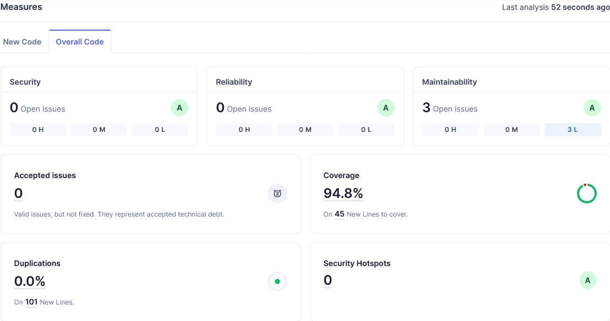
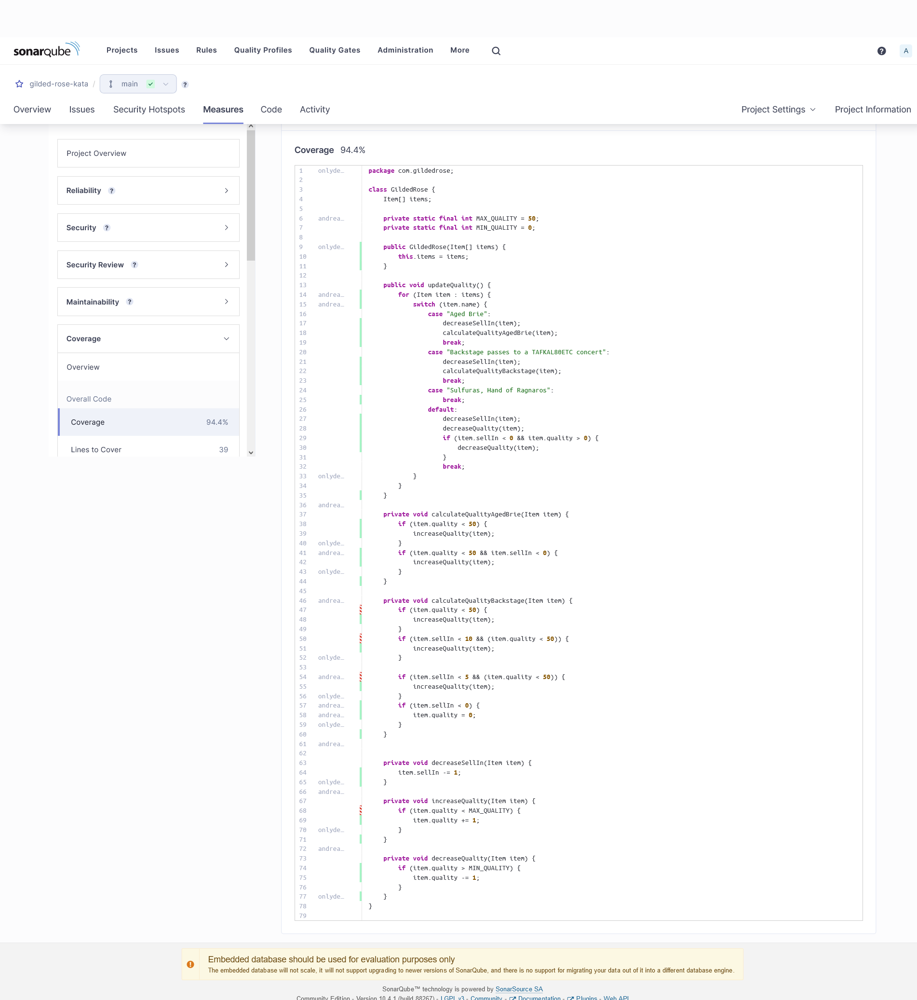

# Herramientas

- JUnit 5
- JaCoCo
- SonarQube
- GitHub Actions
- Gradle
- Java 17

# Reportes de testing

- Necesitarás una imágen de docker de sonarqube, no está cambiada la configuración del JaCoCo por lo tanto se deberá levantar en el puerto 9000
- Mínimo Java 17
- JaCoCo esta configurado para sacar un xml en /reports/jacoco.xml y de ese reporte SonarQube obtendrá la información
- `gradle jacocoTestReport` --> para ejecutar los reportes de JaCoCo
- `gradle build sonar --info` --> para que sonar reprocese los datos
- En el fichero build.gradle tenemos las siguientes dos propiedades, las cuales debes cambiar por el nombre que hayas indicado en tu repositorio local de SonarQube
  - property "sonar.projectKey",
  - property "sonar.projectName",

# Imagenes de reportes de testing

